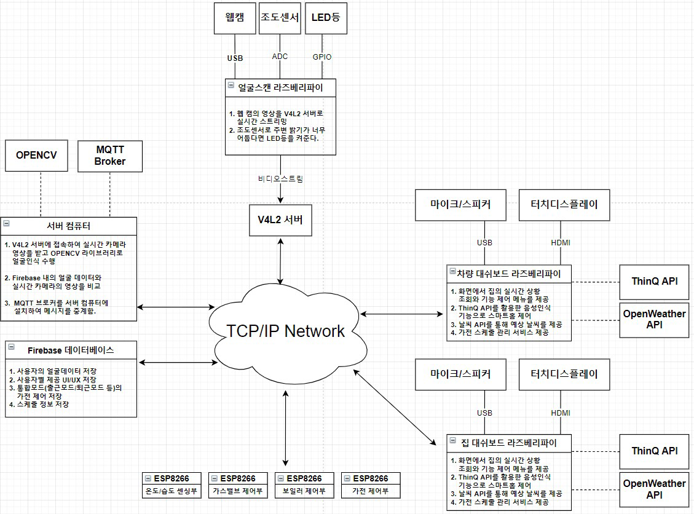
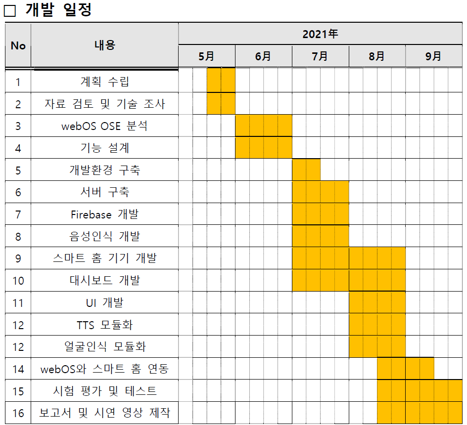

# 2021 ESWContest webOS (삼아아)

### 대회일정

**ㅇ 7월 13일(화), 14:00 ~ 16:00 : 1차 기술지원 교육 (온라인 화상회의 / 추후 링크 전달 예정)**

  \- webOS 개념 설명

**ㅇ 7월 14일(목) : 팀 별 장비배송**

  \- 장비를 받으실 주소를 아래 링크에서 작성 부탁드립니다 (팀 당 1개 주소 기입)

   https://forms.gle/ppRVsqKR2hiwbDbN7

**ㅇ 7월 22일(목)~23일(금), 13:30 ~ 17:00 : 2차 기술지원 교육 (온라인 화상회의 / 추후 링크 전달 예정)**

  \- 팀 별 개발 방향 점검(팀별로 약 40분 진행, 팀 별 진행 시간 상이)

**ㅇ 8월 말 : 3차 기술지원 교육 (온라인 화상회의 / 추후 링크 전달 예정)**

  \- 팀 별 개발 진도 점검(팀별로 약 40분 진행, 팀 별 진행 시간 상이)

**ㅇ 9월1일 ~ 9월27일: 본선 서류 제출**

**ㅇ 10월 초 : 본선 심사**

**ㅇ 10월 말 : 결선 1차(온라인 발표 심사)**

**ㅇ 11월 초 : 결선 2차(오프라인 발표 심사)**

## 개발 개요

### 작품설명

- 차량 내에서 얼굴인식으로 사용자를 인식하여 대시보드 혹은 음성을 통해 스마트 홈을 제어할 수 있는 시스템을 구축한다.
- 사용자는 차량의 대시보드를 통해 집 안 상황과 가전의 동작 현황을 확인할 수 있다. 이 때, 가스밸브, 보일러 등 사용자 외출 시 주의가 필요한 사항이 켜져 있는 경우에는 음성과 알람으로 사용자에게 안내한다.
- 사용자는 집 혹은 차량의 대시보드로 가전의 동작스케줄을 정의할 수 있다. 스케줄은 일시적으로 혹은 반복적으로 정의가 가능하며, 날씨나 온습도를 확인하여 특정 조건에서 가전이 동작을 수행하도록 조건을 만들 수도 있다.

### 전체 구성도

### 각 구성부 상세설명

1. 얼굴스캔 라즈베리파이
- 사용자 인증을 위한 얼굴 인식 촬영 및 스트리밍을 담당하는 부분이다. 라즈베리파이와
연결된 웹캠을 통해 실시간 영상을 V4L2 서버로 실시간 스트리밍한다.
- 사용자의 얼굴 등록은 차량 대시보드로부터 얼굴 등록 명령을 받아 수행한다. 웹캠으로
부터 영상을 촬영하며, 얼굴의 정면, 왼편, 오른편이 잘 찍히도록 해야한다. (대쉬보드 화
면에 영상과 함께 문구를 띄워주어서 등록이 쉽게 되도록 돕는다.) 이 때, 서버 컴퓨터
는 해당 영상에서 사진을 캡처하고 Firebase에 저장하여 학습할 수 있도록 한다.
- 조도센서를 통해 아날로그 값을 ADC 포트로 전달받아 주변의 조도를 확인한다. 만약
얼굴을 인식하기 힘들정도로 어둡다면 LED등을 켜주어 얼굴 인식률 향상에 도움을 줄
수 있도록 한다.
2. 서버컴퓨터
- 서버컴퓨터는 웹캠에서 스캔되는 얼굴이 사용자인지 판단하고, MQTT의 브로커 역할을
맡는다.
- 얼굴인식 활용 기술은 OpenCV와 TensorFlow의 라이브러리를 활용하여 구현한다.
- MQTT의 브로커는 Publisher와 Subscriber 사이에서 메시지의 전송을 중계하는 역할을
한다. 영상 전송을 제외한 나머지 부분의 데이터 송수신은 MQTT 프로토콜을 사용하며,
센싱 데이터, 가전 동작 제어 등의 데이터가 송수신의 예가 될 수 있다.
3. Firebase 데이터베이스
- Firebase는 구글에서 제공하는 실시간 데이터베이스 서비스로 다수의 클라이언트가 데
이터를 저장하고 동기화 할 수 있는 API를 제공한다.
- 여러 기기들이 실시간으로 스케줄, 센싱 데이터, 가전 동작 여부를 편리하게 조회할 수
있어 채택하게 되었다.
- 사용자의 얼굴데이터와 사용자별 UI/UX, 통합모드의 동작 기능, 스케줄 정보, 센싱데이
터와 가전 동작 여부를 Firebase에 저장하여 사용할 계획이다.
4. 집 / 차량 대쉬보드 라즈베리파이
- 대쉬보드 라즈베리파이는 터치 화면과 음성을 통해 집 내부의 상황과 가전 스케줄을 확
인하고 제어할 수 있다.
- 터치 디스플레이를 통해 UI/UX 화면이 제공되며, 이 때 제공되는 UI/UX는 사용자에 따
라 설정이 가능하다.
- 가전을 개별로 제어하는 기능, 가전 스케줄 정의 및 실행하는 기능, 출근/퇴근/여행 등
의 통합메뉴를 제공하는 메뉴가 있다.
- 대쉬보드 라즈베리파이는 특정시간마다 Firebase에 저장된 센싱 데이터 및 가전
ON/OFF 여부를 수집하고 스케줄을 확인하여 시간에 맞게 명령을 내릴 수 있도록 한다.
- 만약, 가스밸브, 도어락, 보일러 등이 켜진 상태로 외출 시 대시보드에 해당 내용을 알
람과 음성으로 출력하여 사용자에게 알리고 제어할 수 있도록 한다.
5. ESP8266 + Arduino R3 / ESP32(집 내부 환경 센싱 및 가전 제어)
- 집 안 환경을 센싱하고 가전을 제어하는 역할로 실제 집 환경에서 유선으로 제어되는
  것 보다는 와이파이를 통해 간편하게 설치되는 것이 좋아보여 ESP8266(orESP32)가 맡
  은 역할을 수행하도록 하였다.
- 집의 온/습도 센싱, 가전 동작, 가스밸브/보일러 동작 여부 확인을 ESP8266을 통하여
  제어할 예정이다.
- ESP8266은 MQTT로부터 토픽을 받으면 해당 센싱데이터나 가전 동작 수행 성공 여부
  를 메시지로 전달한다.

### 하드웨어 구성

- RaspberryPi 4 3EA(얼굴 스캔, 차량 대시보드, 집 대시보드)
- HDMI 지원 및 터치 지원 디스플레이 2EA (차량 대시보드, 집 대시보드)
- ESP32 or ESP8266 + Arduino R3(집의 온/습도 체크 및 GPIO로 가전 제어)
- 릴레이 (가전제어)
- 마이크와 스피커 (음성인식 및 출력)
- 웹캠 (얼굴 인식을 위한 영상 촬영)
- 조도센서 (차량 밝기 측정), 온도센서/습도센서 (집 내부 환경 측정)

### 개발일정

