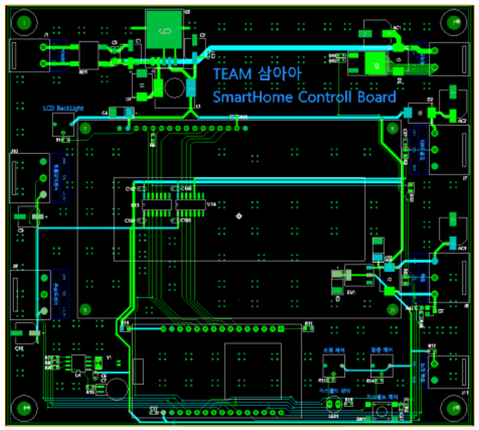

# 제19회 임베디드SW 경진대회 webOS부문 삼아아팀

2021 ESWContest webOS (삼아아) - Car 2 Smart Home 솔루션 개발

작품명 : SMILE : Smart Mobility Improving Life Experience

작품설명 : webOS와 스마트폰의 어플리케이션으로 집의 상황을 확인하고 가전을 제어할 수 있는 서비스를 제공한다. 음성과 메시지를 통해 현재 제어되고 있는 가전과 외출 시 주의가 필요한 가스밸브, 창문 등에 대한 사항을 안내 받을 수 있다. 사용자는 다양한 상황에 맞는 가전의 동작스케줄을 일시적으로 혹은 반복적으로 만들어 사용할 수 있다. 또한, 가전과 모드의 실행 여부를 가전 목록에서 확인하여 조회할 수 있다.

소스코드 : https://github.com/ThreeAmericano

시연동영상 : https://www.youtube.com/watch?v=jM3Lb4GanMw

 

# 개발 개요

## 작품 설명 (소프트웨어 구성도)

- 전체 소프트웨어는 얼굴스캔 부분, 차량 대시 보드, 스마트폰 어플리케이션, 서버, 데이터베이스, 스마트 홈으로 크게 6가지의 파트로 구성 되어있다.
- 얼굴 스캔 부분에는 얼굴인식용 카메라가 부착되어 있어 사용자의 얼굴을 실시간으로 촬영하고 UV4L을 통하여 스트리밍한다. 또한 얼굴 인식 시 주변 밝기가 어두운 경우 이를 감지하여 LED 조명을 제어해 얼굴 인식률을 높인다.
- 차량에서 사용자에게 입력을 받고 각종 정보를 출력해주는 대시 보드는 webOS를 사용 화면을 통해 집의 실시간 상황을 조회하고 가전을 제어할 수 있는 메뉴를 제공한다. 실시간 현황은 실시간 데이터베이스에 업로드 된 스마트 홈 상태와 날씨 API의 관제값과 현재 환경에 맞는 행동 추천을 사용자에게 제공한다. 가전제어는 개별가전제어, 모드제어(일괄 프리셋) 그리고  스케줄제어로  다양하게  제어가  가능해  사용자  편의성을  늘렸다.  또한  Google Assistant를 활용하여 음성인식을 통해서도 가전제어가 가능하다. 
- 차량에서뿐만 아니라 스마트 홈 내부와 일반 외출시에도 가전제어 기능을 사용할 수 있도록 스마트폰 어플리케이션을 구성하였다. 전반적인 기능은 차량 대시 보드와 동일하며, 유사한 UI로 구성하여 사용자가 사용에 편의성을 더 하였다.
- 스마트 홈은 여러 가전기기와 센서로 구성하였으며, 이를 실시간으로 확인할 수 있는 LCD를 부착하였다. 각 가전은 차량 대시 보드와 스마트폰 어플리케이션으로 원격으로 제어가 가능하며, 스마트 홈 내부에서도 직접 제어가 가능하다. 스마트 홈은 센서로부터 얻은 데이터와 가전 동작 상태를 실시간으로 데이터베이스에 업데이트한다.
- 서버는 얼굴스캔 부분에서 제공하는 스트리밍 영상을 받고, 이를 openCV를 이용하여 얼굴인 식을 수행한다. 또한 해당 서버에 AMQP(MQTT) Broker를 구성하였으며, rabbitMQ를 채택 하였다. 스마트 홈 센서를 통해 받아들인 값과 현재 가전상태, 날씨API(OpenWeatherMap) 를 통해 받아온 값을 정제, 가공, 업데이트하는 역할을 수행한다.
- 데이터베이스는 파이어베이스를 사용하였으며 인증 기능과 실시간 데이터베이스 기능을 활용 하여 개발/사용 과정에서의 자원 효율을 높였다.

 

# 각 구성부 설명

## 소프트웨어

### **차량 카메라 (운전자 안면 스캔)**

- Link: https://github.com/ThreeAmericano/CameraStreaming-Part
- 개발환경
  - Target OS : Raspbian
  - Lang. : Python, bash script
  - library : RPi.GPIO, pika

- 사용자 인증을 위한 얼굴 인식 촬영 및 스트리밍을 담당하는 부분이다. 라즈베리파이와 연결된 웹캠을 통해 실시간 영상을 V4L2 서버로 실시간 스트리밍한다.
- AMQP를 통해 얼굴인식 시작 메시지를 받게되면 관련 동작이 시작되며 이때 조도센서를 통해 주변이 어두운 경우 연결되어있는 조명(LED)을 켜 얼굴인식률을 높인다.

 

### **서버 컴퓨터**

- Link: https://github.com/ThreeAmericano/Backend-Server
- Link: https://github.com/ThreeAmericano/MQTT-Server
- 개발환경
  - Target OS : Raspbian
  - Lang. : Python, bash script
  - library : Firebase_admin, re, pika, requests

- 서버컴퓨터는 웹캠에서 스캔되는 얼굴이 사용자인지 판단하고, MQTT의 브로커 역할을 맡는다.
- 얼굴인식 활용 기술은 OpenCV와 TensorFlow의 FaceNet 라이브러리를 활용하여 구현한다.
- MQTT의 브로커는 Publisher와 Subscriber 사이에서 메시지의 전송을 중계하는 역할을한다. 영상 전송을 제외한 나머지 부분의 데이터 송수신은 MQTT 프로토콜을 사용하며, 센싱 데이터, 가전 동작 제어 등의 데이터가 송수신의 예가 될 수 있다.

 

### 얼굴인식 (OpenCV, TensorFlow, FaceNet)

- Link: https://github.com/ThreeAmericano/Face-Recognition
- 개발환경
  - Target OS : Raspbian
  - Lang. : Python, bash script
  - library : tensorflow, scipy, opencv-python

- 이미지 처리
  - 이미지 처리를 위하여 OpenCV 라이브러리를 활용했다.
  - 학습할 사용자의 사진을 촬영한 후, Firebase의 Storage에 저장한다. 
  - 서버는 MTCNN 기반의 얼굴 탐지하여, 얼굴을 182x182 크기로 정렬한다.
- 얼굴 학습
  - 얼굴을 인식하는 얼굴 인식 모듈을 위하여 2015년 구글이 발표한 FaceNet 논문을 활용한 얼굴 인 식을 구현하였다.
  - 얼굴을 학습시킬 때는 160x160로 리사이즈하고, 미리 학습된 FaceNet 모델과 통 합하여 새로운 Crown 모델을 생성한다.
- 얼굴 인식
  - FaceNet 특징 추출, 얼굴 매칭으로 얼굴 인식을 진행한다. 
  - 이는 각 하는 모델로 얼굴 사진에서 사람의 대한 특징 값을 구해주는 모델로 이 값을 활용하여 사 용자를 구분할 수 있다.
  - 특징 추출의 단계에서는 얼굴 이미지를 128차원으로 임베딩하여 유클리드 공간에서 이미지간 거리를 통해 분류하는 triplet loss 기법을 사용한다.
  - 현재 이미지와 모델과의 얼굴 벡터와 거리를 계산하는데 닮을수록 0에 가까워지고 닮지 않을수록 1에 가까운 값이 나온다.
- 실시간 인식
  - 웹 캠으로 촬영하는 영상을 UV4L 스트리밍 서버로 송신하여 처리 서버에서 실시간 인식을 시작한다.
  - 얼굴 사진으로 학습한 crown 모델과 미리 학습된 모델을 사용하여 사용자를 인식한다.
  - 해당 프 로젝트에서는 사용자 배열을 만들고 촬영 프레임마다 인식한 사용자의 count 값을 증가하는 방식 으로 count가 15가 넘어가는(약 1분) 사람을 인식하는 방법을 사용하였다.

 

### **차량  대쉬보드 (webOS)**

- Link: https://github.com/ThreeAmericano/CarDashboard

- 개발환경
  - Target OS : webOS OSE-2.13.g
  - FrameWork : Enact, node.js
  - Lang. : javascript, html, css
  - library : react-dom, react-domm-route

- 대쉬보드 라즈베리파이는 터치 화면과 음성을 통해 집 내부의 상황과 가전 스케줄을 확인하고 제어할 수 있다.
- 터치 디스플레이를 통해 UI/UX 화면이 제공되며, 이 때 제공되는 UI/UX는 사용자에 따라 설정이 가능하다.
- 가전을 개별로 제어하는 기능, 가전 스케줄 정의 및 실행하는 기능, 출근/퇴근/여행 등의 통합메뉴를 제공하는 메뉴가 있다.
- WebApp
  - 대시보드를 구성하는 웹 앱으로 Enact을 사용하여 카 대시보드를 구현하였다.
  - 사용자가 사용할 로그인, 회원가입, 홈, 가전, 모드, 스케줄, 가전 동작 정보+UI 페이지로 구 성되어 있으며, WebOSServiceBridge API 를 이용하여 JS 서비스와 통신하여 기능을 구현했다.
- JS Service
  - 대시보드의 기능을 담당하는 JS Service이다.
  - 사용자 회원가입, 로그인, 스마트 홈 상태 확인, 가전 제어 명령 등 기능을 담당하며 스마트 홈, 서버와 MQTT 송·수신 서비스와 데이터베이 스인 Firebase의 Authentication, Cloud Firestore, Realtime Database의 데이터를 생성, 읽기, 갱신, 삭제한다.

 

### **스마트홈 (ESP8266)**

- Link: https://github.com/ThreeAmericano/ESP32
- 개발환경
  - FrameWork : Arduino
  - Lang. : C
  - library : ESP

- Smarthome의 가전 제어를 담당하는 부분이다.

- ESP32가 WIFI를 통해 MQTT의 메시지를 수 신하고 온/습도, 가전의 상태를 Firebase에 업로드 하도록 한다.

- 무드등, 쿨링 팬등의 가전제 어와 온/습도, 택트버튼 감지 등의 센싱작업들 여러가지 작업들이 통신과 함께 딜레이 없이 이루어져야 하므로 타이머 인터럽트를 통해 시분할 시스템처럼 작동하도록 구성하였다.

- 센싱작업은 60초마다 체크하여 Firebase에 업로드하였고, 무드등처럼 지속적으로 값을 보내줘야 하는 것은 타이머에서 주기적으로 Drive하도록 하였다.

- 일반적으로 while문에서는 MQTT 서버 끊김과 메시지가 수신 여부를 체크하여 수신시 작업을 수행하도록 진행하였다.

  

- 집 안 환경을 센싱하고 가전을 제어하는 역할로 실제 집 환경에서 유선으로 제어되는 것 보다는 와이파이를 통해 간편하게 설치되는 것이 좋아보여 ESP8266(orESP32)가 맡은 역할을 수행하도록 하였다.

- 집의 온/습도 센싱, 가전 동작, 가스밸브/보일러 동작 여부 확인을 ESP8266을 통하여 제어할 예정이다.

- ESP8266은 MQTT로부터 토픽을 받으면 해당 센싱데이터나 가전 동작 수행 성공 여부를 메시지로 전달한다.

- 대쉬보드 라즈베리파이는 특정시간마다 Firebase에 저장된 센싱 데이터 및 가전ON/OFF 여부를 수집하고 스케줄을 확인하여 시간에 맞게 명령을 내릴 수 있도록 한다.

- 만약, 가스밸브, 도어락, 보일러 등이 켜진 상태로 외출 시 대시보드에 해당 내용을 알람과 음성으로 출력하여 사용자에게 알리고 제어할 수 있도록 한다.

 

### 안드로이드 어플

- Link: https://github.com/ThreeAmericano/Android
- 개발환경
  - Target OS : Android 11
  - Lang. : Kotlin, Java
- 스마트 홈 가전 제어 및 상태를 조회할 수 있는 안드로이드 어플리케이션이다.
- WebOS의 웹 앱과 동일한 기능과 유사한 UI로 제작하였다.

 

## 데이터베이스 (Firebase)

- Firebase는 구글에서 제공하는 실시간 데이터베이스 서비스로 다수의 클라이언트가 데이터를 저장하고 동기화 할 수 있는 API를 제공한다.
- 여러 기기들이 실시간으로 스케줄, 센싱 데이터, 가전 동작 여부를 편리하게 조회할 수 있어 채택하게 되었다.
- 데이터베이스는 Firebase를 채택하였고 nosql 방식이다. 스마트 홈 사용자를 기준으로 하여, 연결된 모든 클라이언트 기기들이 위 그림과 같은 데이터베이스 세트를 사용하게 된다. 각 데이터베이스 컬렉션에 관련된 설명은 아래와 같다.

1.  authentication : 각 사용자의 계정정보(Email, Password, UID)를 암호화하여 관리
2.  user_account : 각 사용자의 부가정보(이름)을 저장
3.  uiux_preset : 각 사용자별로 사용할 UI/UX 정보를 저장
4.  modes : 각 모드에 따른 가전정보 프리셋 값을 저장
5.  schedule_mode : 사용자가 추가한 스케줄 정보를 저장
6.  storage : 얼굴 인식을 위하여 각 사용자의 얼굴 사진을 저장
7.  realtime database : 실시간으로 변동되는 값을 저장 (센싱값, 가전상태 등)

 

## 하드웨어 구성

### 스마트홈

- 
- 스마트 홈은 컨트롤 보드를 설계하여 제 어하도록 구성하였다.
- MCU는 와이파이 모 듈이 내장되어 있는 ESP32를 선정하였고 가전은 스마트 홈에서 보편적으로 많이 제 어되는 에어컨, 무드등, 가스밸브, 창문으로 구성하였다. 센서는 온ᆞ습도 센서로 집 내 부 온습도를 측정하고, 빗물감지센서를 통 해 갑작스러운 소나기 등의 날씨 변화를 감 지하여 사용자에게 알려줄 수 있도록 구성 하였다.

### 얼굴촬영 라즈베리파이

- 
- 얼굴 인식 로그인을 위해 영상을 촬영하여 스트리밍을 담당하는 부분이다.
- 라즈베 리파이3B+를 사용하였고, 카메라는 로지 텍의 C310을 사용하였다. 라즈베리파이가 조도센서를 통해 얼굴 촬영 시 밝기가 어 두우면 조명을 켜서 얼굴 인식률을 향상시 킬 수 있도록 구성하였다.

 

# 기타

## 개발중 발생한 장애요인

### 차량 측 UV4L 스트리밍시 다른 네트워크에서 접근 불가능

- 얼굴인식을 진행하기위하여 차량측에 카메라를 부착하고 이를 UV4L을 통하여 web으로 스트 리밍을 진행하였으나, IP로 접근이 필요하여 다른 네트워크에 있고 해당 네트워크로부터 포 트포워딩을 받을 수 없는 경우 접근이 제한되어 문제가 발생.

- 서버를 통해 가상 네트워크(VPN)를 구축하고, IP를 배정하여 얼굴인식 서버와 차량 측 카메라 간에 원활한 통신이 가능하도록 함. 

### 스마트 홈(ESP32) 측 성능이슈로 AMQP 사용 불가능.

- 스마트 홈 측 ESP32의 성능 이슈로 AMQP를 통한 통신이 연결 단계에서부터 비정상적으로 진행되는 문제가 발생.
- rabbitMQ Broker에 기본 프로토콜인 AMQP와 더불어 추가로 MQTT 를 사용할 수 있도록 플 러그인(rabbitmq_mqtt)을 설치하고, Broker측에서 MQTT통신에 사용할 계정정보와 접근권 한 exchange 및 listener 등을 설정. 
- 스마트 홈(ESP32)는 다른 기기들과 다르게 AMQP가 아닌 MQTT로 통신을 진행하며, 그로 인 해 발생하는 차이는 Broker가 보완함.

### 산발적 데이터베이스 조회로 인한 자원 낭비

- 여러 기기에서 산발적으로 데이터베이스를 조회하여 기기 및 데이터베이스 모두 필요 이상 의 자원낭비가 발생함. (변경된 내용이 없으나 새로 읽어오는 경우)
- Firebase SDK에서 제공하는 Listener를 이용하여 Thread를 만들어 두면, 데이터베이스가 변경 이 되었을 때 이를 감지하고, callback 함수가 실행되어 처리로직을 자동으로 실행할 수 있 게 됨.
- 필요한 데이터를 polling 할 필요가 없어 기기의 자원 낭비를 방지할 수 있으며, 어플리케이션 은 매시점에서 언제나 최신 데이터를 가지고 있게 됨.

### ESP 8266 + WiFi 모듈 펌웨어 업로드 이슈

- 펌웨어 업로드 시 8266과 WiFi 모듈 사이에 오류가 발생하고 테스트 시 매번 배선을 하는 장 애 및 번거로움 발생
- WiFi 일체형 모델인 ESP 32로 대체하여 장애요인을 개선하였다.

###  FaceNet 윈도우 테스트 버전 -> 리눅스 서버

- 윈도우 콘다 가상환경으로 테스트했던 얼굴 인식 FaceNet 모델을 리눅스 서버로 이식하는 과정에서 윈도우에서 사용했던 가상환경이 리눅스 환경에서는 바로 이식되지 않음
- 테스트 코드는 수정하지 않고 리눅스 환경에서 새로 환경을 꾸려 이상 없이 이식하였다

 

## 주요기능

### 모드 가전 제어

- 실내, 실외, 슬립, 에코 모드를 제공하여 개별적인 가전 제어가 아닌 한번의 동작으로 여러 가 전을 제어할 수 있다. 이를 통해 가전들을 다양한 상황에 알맞은 동작을 하는 제어를 한 번 에 할 수 있다. 또한 사용자가 모드 동작을 직접 설정할 수 있어 사용자가 자신에 맞는 상황 으로 제어할 수 있다.
예) 외출 모드 : 에어컨 OFF, 무드등 OFF, 가스 밸브 OFF, 창문 OFF 에코 모드 : 에어컨 OFF, 무드등 OFF, 가스 밸브 OFF, 창문 ON

### 예약 스케쥴 작업

- 사용자가 원하는 가전의 상태를 단발성 혹은 반복성 있게 제어할 수 있다. 
> 단발성 스케줄의 경우 사용자가 원하는 일시에 집 안 가전 상태를 설정하면 해당 시각에 동작을 수행한다. 
> 반복성 스케줄의 경우, 반복될 요일, 시간을 선택하여 가전의 상태를 선택하면 주기적으 로 해당 스케줄을 수행한다. 
- 출장, 여행 등 반복적이지 않은 상황에서 미리 가전의 상태를 예약하여 사용할 수 있다. - 출근시간, 퇴근시간의 스케줄을 등록해두면 사용자가 동작 시키지 않아도 알아서 가전을 켜고 끄는 제어를 할 수 있다.

### 환경기반 자동 안내 (비올 때 창문닫기, 가스벨브 열리면 경고)

- 스마트 홈의 센서로 집안의 온습도 및 Open Weather Map API를 활용하여 날씨를 확인 - 가전 상태가 알림이 필요한 상황, 날씨와 가전 상태와 같이 판단하여 자동 안내
- TTS + Toast로 추천 동작 내역을 안내한다. 예) 가스밸브 열림 : “가스 밸브가 열려있어요”
미세먼지 나쁨 + 창문 열림 : “대기질이 좋지 않아 창문을 닫아주세요”

### 음성 알림

- 사용자가 운전 중에는 대시보드를 직접 동작 할 수 없다. 따라서 가전 상태의 변화 및 안내사 항을 TTS 서비스로 안내하여 사용자가 안전하게 정보를 전달받을 수 있도록 했다.

### 다크모드

- 밝은 색상을 제어하여 눈의 피로를 줄여준다. - 주변 조명이 낮은 상황에서도 잘 보인다.

 

## 개발일정

## 업무분장

    

## 참고사항

### 사이트

 - webOS 공식 사이트 (https://www.webosose.org/)
 - webOS 빌드완료된 이미지 모음 (http://build.webos-ports.org/webosose/)
 - 임베디드SW경진대회 사무국 (02-2046-1436 / contest@fkii.org / https://www.eswcontest.or.kr)
 - 2020년도 수상작 JARVIS github (https://github.com/2020ESWContest-webOS-4004)

### 대회일정

- 7월 13일(화), 14:00 ~ 16:00  
      - 1차 기술지원 교육 (온라인 화상회의 / 링크 전달 예정)  
      - webOS 개념 설명  
- 7월 14일(목) : 팀 별 장비배송  
- 7월 22일(목)~23일(금), 13:30 ~ 17:00'  
      - 2차 기술지원 교육 (온라인 화상회의 / 링크 전달 예정)  
      - 팀 별 개발 방향 점검(팀별 약 40분 진행)  
- 8월 말  
      - 3차 기술지원 교육 (온라인 화상회의 / 링크 전달 예정)  
      - 팀 별 개발 진도 점검(팀별 약 40분 진행)  
- 9월1일 ~ 9월27일: 본선 서류 제출  
- 10월 초 : 본선 심사  
- 10월 말 : 결선 1차 (온라인 심사)
- 11월 2일 : 결선 서류 제출
- 11월 18일 : 결선 오프라인 심사 (코엑스)

### 대회 개최

- 주최: 산업통상자원부
- 주관: 임베디드소프트웨어 시스템산업협회

 

---

